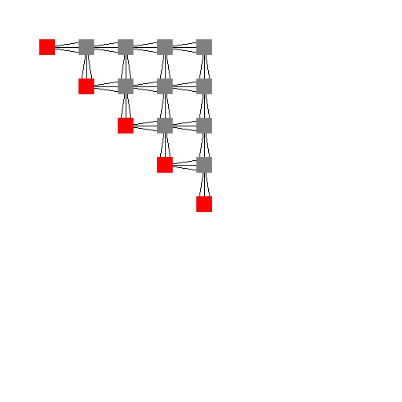
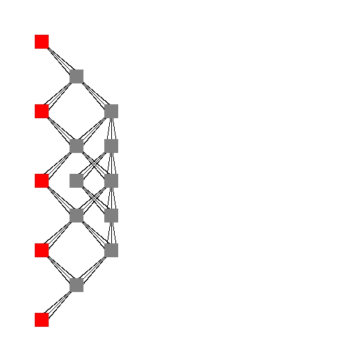

# Projektowanie systemów - Back Substitution

<br>

## Przydatne komendy

 - stworzenie środowiska wirtualnego: <br>
    ```python -m venv <nazwa_katalogu>```

 - uruchomienie środowiska <br>
     - Linux: <br>
        ```source <nazwa_katalogu>/bin/activate```<br> 
     - Windows: <br>
        ```<nazwa_katalogu>\Scripts\activate.bat```

 - instalacja bibliotek (wymaga instalatora "pip"): <br>
    ```pip install -r requirements.txt```

 - uruchomienie skryptu: <br>
    ```python backSubstitution.py```

## Algorytm 
```python
def back_substitution(a, b):
    N = len(a)
    x = [0] * N 

    for i in range(N-1, -1, -1):
        x[i] = b[i] / a[i][i]
        for j in range(i-1, -1, -1):
           b[j] = b[j] - a[j][i] * x[i]
    return x
```

## Generowane grafy

